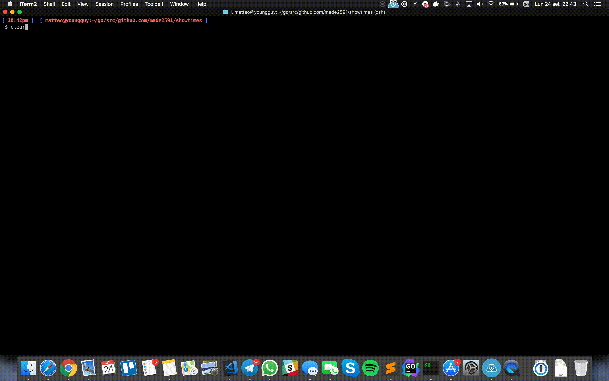

# GO-erlangen

GO-erlangen is a super dirty draft create around [https://www.internationalshowtimes.com/](https://www.internationalshowtimes.com/) to help you list showtimes of Original Language movies in Erlangen (Germany, Bayern) cinemas.

```shell
git clone https://github.com/made2591/go-erlangen.git
cd go-erlangen
go run main.go
```
Movies will be filtered and list automatically, by pressing enter you can go ahead in listing...

<p>
	
</p>

## Dependencies

There are no dependencies. The code is super wrong written you can do so much more, it's just a draft

Thanks to [https://www.internationalshowtimes.com/](https://www.internationalshowtimes.com/) for providing me a trial api key.

## Improvements

- Build a webinterface with parameters for search
- Introduce... almost everything
